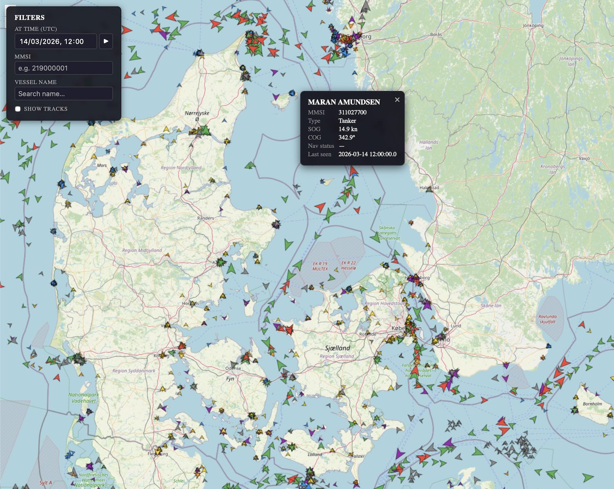

# AIS Maritime Data Pipeline

A pipeline for ingesting raw AIS (Automatic Identification System) maritime data, transforming it into partitioned GeoParquet files, and querying with Apache Sedona.



## What it does

```
Raw AIS (NMEA / CSV) → Parse & Decode → Validate & Clean → Enrich → GeoParquet
                                                                   └→ Build Tracks → Tracks GeoParquet
```

Three output tables:

- **Positions** — one row per AIS message, partitioned by `date=` and `h3_r3=` (H3 resolution 3, ~500 km cells)
- **Vessel Metadata** — slowly-changing dimension, one row per MMSI
- **Tracks** — derived voyage segments (LineString geometries), partitioned by month

## Technology

| Scale | Stack |
|---|---|
| < 1 TB/day | Plain Java — `aismessages` + JTS + Apache Parquet + H3-Java |
| > 1 TB/day | Apache Spark 3.5 + Apache Sedona 1.6 |

## Data layout

```
data/
  positions/date=YYYY-MM-DD/h3_r3=<cell>/part-*.parquet
  vessels/part-*.parquet
  tracks/date=YYYY-MM/part-*.parquet
```

## Modules

| Module | Description |
|---|---|
| [`ais-io`](ais-io/) | Plain-Java ingestion pipeline — parse, validate, write GeoParquet |
| [`ais-backend`](ais-backend/) | Quarkus REST API — import endpoints + Sedona queries |
| [`ais-frontend`](ais-frontend/) | React + OpenLayers map UI |

`ais-io.sh` — convenience wrapper around the `ais-io` fat JAR (run `./ais-io.sh --help` for usage).

## Quick start

```bash
# Build both Java modules
cd ais-io && mvn package -q && cd ..
cd ais-backend && mvn package -DskipTests && cd ..

# Start Spark + backend + frontend
docker compose up
```

- Frontend: http://localhost:3000
- Backend API: http://localhost:8080
- Spark UI: http://localhost:4040

## Implementation phases

1. **Phase 1** — Parse one day of CSV, validate, write GeoParquet, verify Sedona reads it
2. **Phase 2** — Add H3 partitioning, NMEA input, vessel metadata join
3. **Phase 3** — Track builder: voyage segmentation, JTS LineString, tracks GeoParquet
4. **Phase 4** — Scale to Spark/Sedona, incremental daily ingestion, data quality monitoring

## Test files

Sample NMEA AIS data is in [`test-files/`](test-files/). All files contain raw `!AIVDM` sentences parseable by `com.github.tbsalling:aismessages`.

| File | Lines | Description | Source |
|---|---|---|---|
| `nmea-sample-large.txt` | 85,194 | Large corpus for volume testing | [M0r13n/pyais](https://github.com/M0r13n/pyais/blob/master/tests/nmea-sample) (originates from Kurt Schwehr's gpsd test corpus) |
| `sample-800lines.aivdm` | 1,121 | Medium sample from real vessel traffic | [ianfixes/nmea_plus](https://github.com/ianfixes/nmea_plus/blob/master/spec/standards/sample.aivdm) |
| `mixed_types.nmea` | 108 | Covers many AIS message types (1–27) | [GlobalFishingWatch/ais-tools](https://github.com/GlobalFishingWatch/ais-tools/blob/master/sample/mixed_types.nmea) |
| `multi-part.nmea` | 93 | Multi-part messages (e.g. Type 5 vessel static data) | [GlobalFishingWatch/ais-tools](https://github.com/GlobalFishingWatch/ais-tools/blob/master/sample/multi-part.nmea) |
| `sample.nmea` | 2 | Minimal example | [GlobalFishingWatch/ais-tools](https://github.com/GlobalFishingWatch/ais-tools/blob/master/sample/sample.nmea) |
| `errors.nmea` | 4 | Malformed / edge-case messages | [GlobalFishingWatch/ais-tools](https://github.com/GlobalFishingWatch/ais-tools/blob/master/sample/errors.nmea) |

Good starting points: `mixed_types.nmea` for type coverage, `nmea-sample-large.txt` for volume testing.
