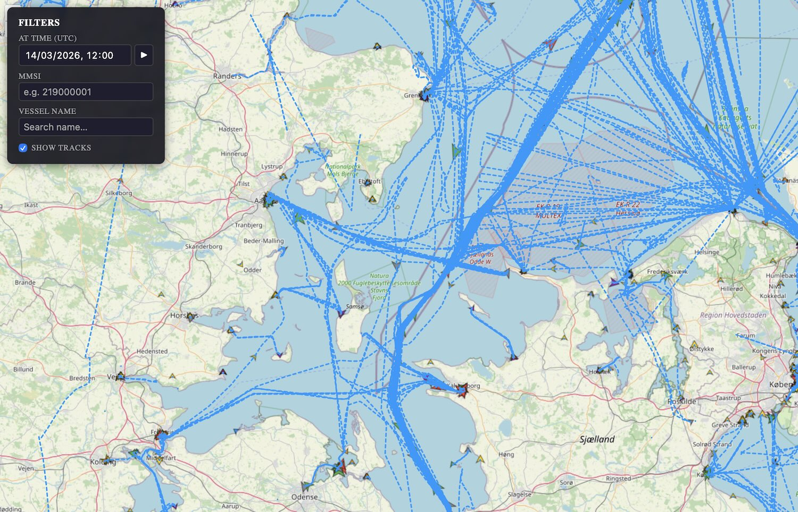

# ais-frontend

React + OpenLayers UI for the AIS vessel tracking pipeline. Displays live vessel positions on a full-screen map with filtering by date, MMSI, and vessel name.




## Stack

- **React 18** + **TypeScript**
- **OpenLayers 9** — map rendering, WKT parsing, overlays
- **Vite 5** — dev server and build

## Development

```bash
npm install
npm run dev        # http://localhost:5173
```

Requires the backend running on `http://localhost:8080`. The Vite dev server proxies `/api/*` there automatically.

## Build

```bash
npm run build      # output in dist/
```

## Docker

```bash
# From the repo root:
docker compose up --build
```

The frontend is served by nginx on **http://localhost:3000**. nginx proxies `/api/*` to the `backend` service.

## Project structure

```
src/
├── types/ais.ts          # Shared TypeScript interfaces
├── api/                  # Fetch wrappers (positions, vessels, tracks)
├── hooks/                # useMapBbox, usePositions, useVesselSearch, useTracks
├── map/                  # OpenLayers components (OlMap, VesselLayer, TracksLayer, vesselStyle)
└── components/           # FilterPanel, VesselPopup
```

## Features

- **Vessel layer** — chevron icons rotated by COG, colored by ship type
- **Filter panel** — date range, MMSI, vessel name with autocomplete, tracks toggle
- **Vessel popup** — click any vessel to see name, SOG, COG, nav status, destination
- **Tracks layer** — dashed voyage lines, toggled via filter panel
- **Play mode** — ▶ button next to the time picker auto-advances the selected time by 5 minutes every 5 seconds, animating vessel movement through the day; press ⏸ to pause
- All API calls use `AbortController` to cancel in-flight Spark queries on parameter change

## Environment

| Variable | Default | Description |
|---|---|---|
| `VITE_API_BASE_URL` | `""` | API base URL (empty = use Vite proxy in dev, set to `/api` in Docker build) |
